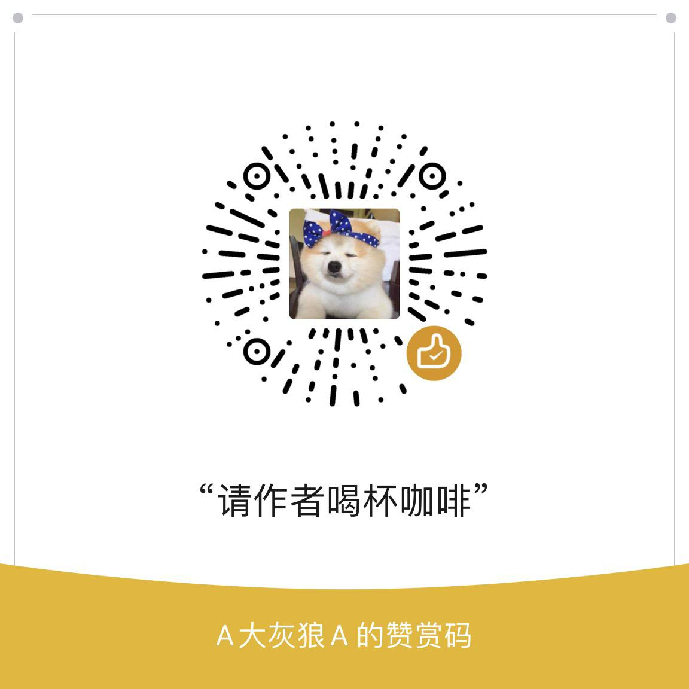

| **项目名称** | **站点链接**                                                                                     |
|--------------|--------------------------------------------------------------------------------------------------|
| **番茄书院** | [](https://api.langge.tk) |
| **QQ群组**   | [](https://qm.qq.com/q/Bvrs8BPqLY) |
| **TG交流群** | [](https://t.me/dahuilang888) |

#### 🚩 🍅无限制书源：
```
https://gh.llkk.cc/https://raw.githubusercontent.com/shidahuilang/shuyuan/refs/heads/shuyuan/azyd.json
```
#### 🚩 番茄无密钥版本：
```
https://gh.llkk.cc/https://raw.githubusercontent.com/shidahuilang/shuyuan/refs/heads/shuyuan/cxyd.json
```

**自动更新时间** 2025-02-01 18:32:35 CST+0800
#### 🚩 最新阅读书源修复-每隔3天自动更新一次（安卓阅读3.0+读不舍手+千阅+源阅读+花火阅读通用）
#### 🚩 获取后的书源会自动效验

<!-- 更新位置开始 -->
| 阅读源总数 | 有效书源数 | 无效书源数 | 重复书源数 |
|------------|------------|------------|--------------|
| <span style="color:green;">36</span> | <span style="color:blue;">20</span> | <span style="color:red;">16</span> | <span style="color:orange;">0</span> |
<!-- 更新位置结束 -->

#### 🚩 效验书源链接
```
https://gh.llkk.cc/https://raw.githubusercontent.com/shidahuilang/shuyuan/shuyuan/good.json
```

#### 🚩 规则净化
```
https://gh.llkk.cc/https://raw.githubusercontent.com/shidahuilang/shuyuan/shuyuan/jinghua.json
```
#### 🚩 TTS-在线语音包生成[点我](https://tts.228088.xyz)
详见[文档](https://github.com/shidahuilang/shuyuan/blob/shuyuan/doc.md)
#### 🚩 TTS-70种语音包
```
https://gh.llkk.cc/https://raw.githubusercontent.com/shidahuilang/shuyuan/shuyuan/tts.json
```

#### 🚩 香色闺阁-每隔3天自动更新一次

**自动更新时间** 2025-02-01 18:32:35 CST+0800
 ``` bash
https://gh.llkk.cc/https://raw.githubusercontent.com/shidahuilang/shuyuan/shuyuan/sourceModelList.xbs
 ``` 
 ``` bash
https://gh.llkk.cc/https://raw.githubusercontent.com/shidahuilang/shuyuan/shuyuan/xsreader/new/resources.txt
 ```
#### 🚩 爱阅书香书源
 ``` bash
https://gh.llkk.cc/https://github.com/shidahuilang/shuyuan/raw/shuyuan/aiyueshuxiang.ibs
 ```
#### 🚩 uz影视源
```
https://gh.llkk.cc/https://raw.githubusercontent.com/shidahuilang/shuyuan/shuyuan/UZ.json
```
#### 🚩 IPTV源
 ```
https://iptv.228088.xyz/cn.m3u
 ```
#### 🚩 感谢您使用此项目！


#### 🚩 ESign/AltStore/SideStore/锤子助手 巨魔商店应用
导入链接
```
https://raw.githubusercontent.com/shidahuilang/shuyuan/shuyuan/ipa.json
```

<!-- [](https://starchart.cc/shidahuilang/shuyuan) -->

